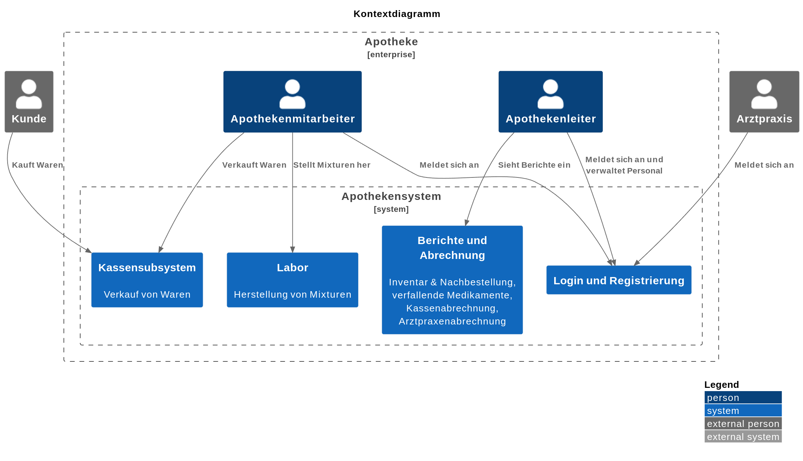

= Entwicklerdokumentation
:project_name: name-des-projekts
:toc: left
:numbered:

[options="header"]
[cols="1, 3, 3"]
|===
|Version | Bearbeitungsdatum   | Autor 
|...	| ... | ...
|===

== Einführung
* Aufgabenstellung

== Randbedingungen
=== Hardware-Vorgaben
Eine Liste der erforderlichen Geräte/Hardware zur Ausführung und Verwendung der Anwendung:

* **Server** (bzw. Apotheken-Computer)
* **Desktop-System** mit Maus und Tastatur (für die drei Kassen und die SB-Kasse).
  Die Kassen sind jeweils mit einem Strichcode-Scanner ausgestattet.

=== Software-Vorgaben

==== Server
Auf dem Server ist die folgende (oder neuere) Java-Version erforderlich:
- Java 24

==== Client
Auf dem Client ist eine der folgenden (oder neueren) Browser-Versionen erforderlich:

- Google Chrome (oder Chromium-basiert) 131.0.0
- Firefox 130.0.0
- Safari 18.0
- Opera 114.0.0

Der Browser muss in der Lage sein, Cookies zu speichern.

=== Vorgaben zum Betrieb der Software

Das System wird zum Verkauf von Waren in der Apotheke eingesetzt. Die Software soll auf einem Server betrieben werden und durch die Nutzer über eine Weboberfläche bedienbar sein.

Die Nutzer der Software sind Kunden, Arztpraxen, Apothekenmitarbeiter und der Apothekenchef. Die Nutzeroberfläche soll deswegen für Menschen ohne technischen Hintergrund intuitiv bedienbar sein.

Die Anwendung muss Daten in einer Datenbank persistent speichern und für die Nutzer (je nach Rolle/Zugriffsberechtigung) zugänglich machen (d.h. die Nutzer sollen keine SQL-Anfragen schreiben müssen).

== Kontextabgrenzung

== Lösungsstrategie
=== Erfüllung der Qualitätsziele
[options="header"]
|=== 
|Qualitätsziel |Lösungsansatz
|... |...
|===

=== Softwarearchitektur
* Beschreibung der Architektur anhand der Top-Level-Architektur oder eines Client-Server-Diagramms

=== Entwurfsentscheidungen
* Verwendete Muster
* Persistenz
* Benutzeroberfläche
* Verwendung externer Frameworks

[options="header", cols="1,2,3"]
|===
|Externes Package |Verwendet von |Warum
|... |... |...
|===

== Bausteinsicht
* Package-Diagramm
* Entwurfsklassendiagramme der einzelnen Packages

[options="header"]
|=== 
|Klasse/Enumeration |Description
|... |...
|===

=== Rückverfolgbarkeit zwischen Analyse- und Entwurfsmodell
_Die folgende Tabelle zeigt die Rückverfolgbarkeit zwischen Entwurfs- und Analysemodell._

[options="header"]
|===
|Klasse/Enumeration (Analysemodell) |Klasse/Enumeration (Entwurfsmodell)
|... |...
|===

== Laufzeitsicht
* Darstellung der Komponenteninteraktion anhand eines Sequenzdiagramms, welches die relevantesten Interaktionen darstellt.

