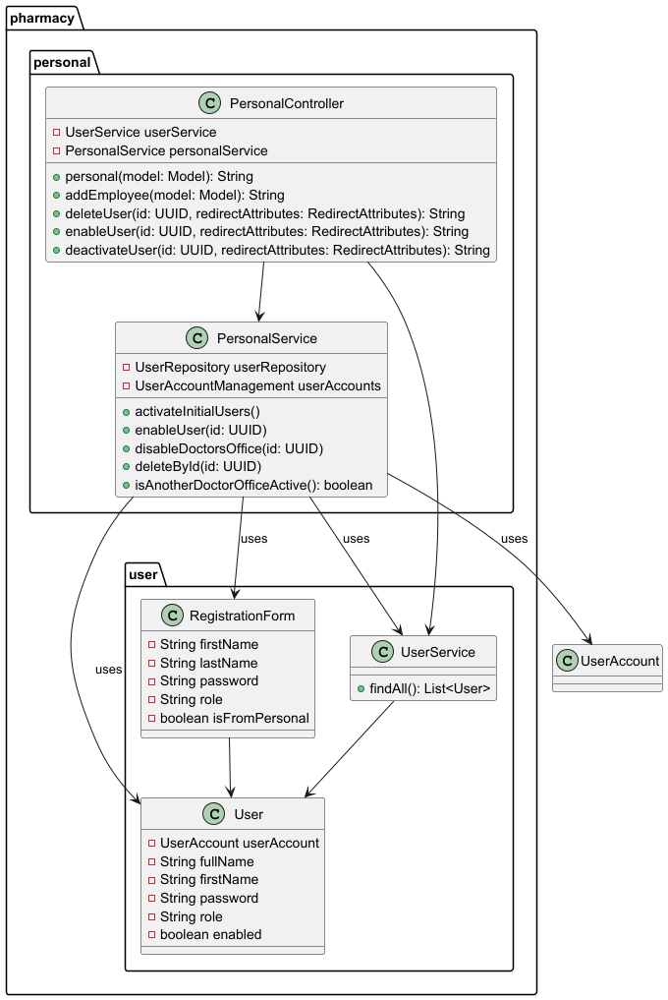
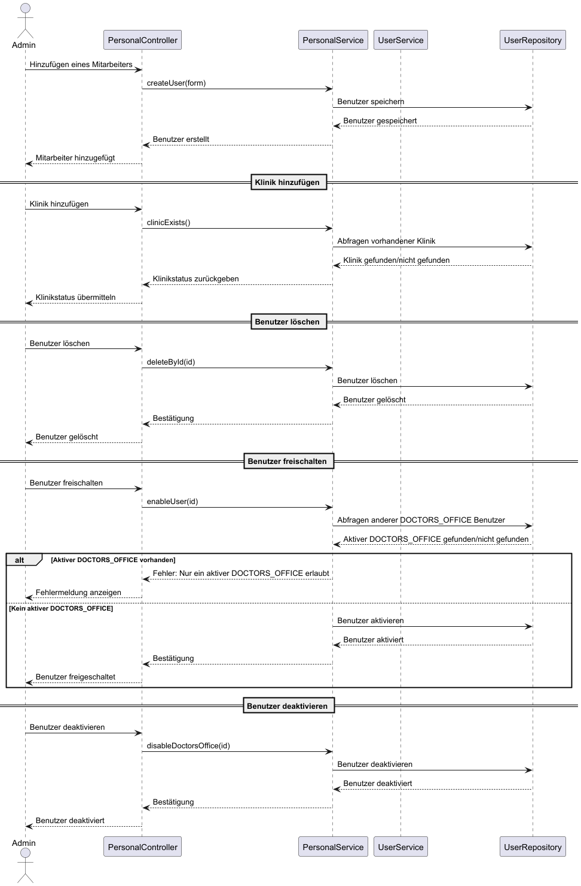

= Entwicklerdokumentation
:project_name: name-des-projekts
:toc: left
:numbered:

[options="header"]
[cols="1, 3, 3"]
|===
|Version | Bearbeitungsdatum   | Autor 
|...	| ... | ...
|===

== Einführung
* Dem großen Unterbrunner Ärztehaus wird eine Apotheke angegliedert. Es handelt sich um 
einen Verkaufsraum mit drei Kassen und einer Selbstbedienungsabteilung für nicht 
rezeptpflichtige Waren (Pflaster, medizinische Badezusätze, Gesundheitstees aller Art, 
Pflegesalben etc.).

* Daneben gibt es ein kleines chemisches Labor, wo auf Anforderung 
der Ärzte spezielle Pulver, Salben und Tinkturen bereitet werden können (abzuholen einen 
Tag nach Bestellung).  

* Bei Bestellungen von Mixturen oder nicht vorrätigen Medikamenten werden den Kunden 
Bestellzettel mit einer eindeutigen Identifikationsnummer ausgegeben (das Rezept 
verbleibt in der Apotheke).

* Die  Apothekenschränke  sind  wie  üblich  alphabetisch  sortiert.  An  jeder  
Medikamentenpackung ist ein Strichcode angebracht, welcher das Medikament und die  
Packungsgröße eindeutig identifiziert. Bei Verkauf eines Medikaments wird der Code an 
der Kasse eingelesen.
Auf diese Weise wird der Posten auf die Kundenrechnung und 
gleichzeitig in die tägliche Nachbestellung übernommen.

* Medikamente werden entweder wie andere Waren bar bezahlt oder an Kassenpatienten 
gegen Entrichtung der Zuzahlung (10% des Preises, jedoch mindestens 5 EUR und 
maximal 10 EUR pro Arzneimittel) abgegeben. Kassenleistungen werden von den 
Apotheken mit einer Zentralkasse monatlich abgerechnet.

* Mit Hilfe der neuen Apotheke ersparen sich die Praxen auch die Bewirtschaftung eigener 
Medizinvorräte: Neben den Mitarbeitern der Apotheke haben auch die Ärzte und einige 
besonders zuverlässige Arzthelferinnen jederzeit Zugang zum Medikamentenschrank. Für 
diesen Zweck gibt es eine Tür zur Apotheke, die vom Ärztehaus aus durch Eingabe einer 
praxisspezifischen PIN geöffnet werden kann. Auf der anderen Seite der Tür befindet sich 
ein Lesegerät, an dem beim Verlassen der Strichcode der entnommenen Medikamente 
erfasst wird. Zwecks eindeutiger Zuordnung der Medikamente und um den Betrieb der 
Apotheke nicht übermäßig zu stören, hat zu einem Zeitpunkt höchstens eine Praxis 
Zugang zur Apotheke. Die Ärzte haben erklärt, dass dies keine wesentliche Einschränkung 
darstellt. Die Abrechnung mit den einzelnen Arztpraxen erfolgt monatlich.  

* Alle Lesegeräte sind an den Computer der Apotheke angeschlossen, über den die 
automatische Nachbestellung von Medikamenten, die eigene Bilanz und die Abrechnung 
mit den Ersatzkassen läuft. Außerdem wird an diesem Computer wöchentlich eine Liste 
der Medikamente ausgedruckt, deren Verfallsdatum in der nächsten Woche erreicht wird 
oder das schon überschritten ist. Diese werden wöchentlich ausgesondert.   

* Die Einführung eines weiteren Dienstes - die Auslieferung von Medikamenten an das 
nahegelegene Altersheim und andere bewegungseingeschränkte Patienten wird derzeit 
diskutiert. 

== Randbedingungen
=== Hardware-Vorgaben
Eine Liste der erforderlichen Geräte/Hardware zur Ausführung und Verwendung der Anwendung:

* **Server** (bzw. Apotheken-Computer)
* **Desktop-System** mit Maus und Tastatur (für die drei Kassen und die SB-Kasse).
  Die Kassen sind jeweils mit einem Strichcode-Scanner ausgestattet.

=== Software-Vorgaben

==== Server
Auf dem Server ist die folgende (oder neuere) Java-Version erforderlich:
- Java 24

==== Client
Auf dem Client ist eine der folgenden (oder neueren) Browser-Versionen erforderlich:

- Google Chrome (oder Chromium-basiert) 131.0.0
- Firefox 130.0.0
- Safari 18.0
- Opera 114.0.0

Der Browser muss in der Lage sein, Cookies zu speichern.

=== Vorgaben zum Betrieb der Software

Das System wird zum Verkauf von Waren in der Apotheke eingesetzt. Die Software soll auf einem Server betrieben werden und durch die Nutzer über eine Weboberfläche bedienbar sein.

Die Nutzer der Software sind Kunden, Arztpraxen, Apothekenmitarbeiter und der Apothekenchef. Die Nutzeroberfläche soll deswegen für Menschen ohne technischen Hintergrund intuitiv bedienbar sein.

Die Anwendung muss Daten in einer Datenbank persistent speichern und für die Nutzer (je nach Rolle/Zugriffsberechtigung) zugänglich machen (d.h. die Nutzer sollen keine SQL-Anfragen schreiben müssen).

== Kontextabgrenzung
image::models/design/context.png[]

== Lösungsstrategie
=== Erfüllung der Qualitätsziele
[options="header", cols="1h,5"]
|=== 
|Qualitätsziel |Lösungsansatz

|Korrektheit
|Die Korrektheit der Berechnungen und Abläufen wird durch Unit-Tests sichergestellt. Hier kommt das Salespoint-Framework zum Einsatz, das einige Aufgaben (z.B. das Erfassen von Beständen) übernimmt.

|Sicherheit
a|
* **Vertraulichkeit:** nur berechtigte Personen dürfen auf sensible Daten zugreifen. Dazu werden Spring Security (`@PreAuthorize`), Salespoint (`@LoggedIn`) sowie Thymeleaf (`sec:authorize`) verwendet.

* **Integrität:** die Anwendung soll das unauthorisierte Ändern von Daten verhindern. Dazu werden ebenfalls Spring Security und Salespoint (siehe Vertraulichkeit) benutzt.

|Nutzbarkeit
a|
* **Lernbarkeit:** die Anwendung soll für die Nutzer verständlich sein. Das wird u.a. durch eindeutige Beschreibungen von Textfeldern realisiert.

* **Fehlerbehandlung:** die Anwendung soll ungültige Eingaben erkennen. Diese dürfen nicht zum ungültigen Systemzustand führen.

* **Barrierefreiheit:** die Anwendung soll von möglichst vielen (potentiell eingeschränkten) Personen bedienbar sein. Dies wird u.a. durch angemessene Schriftgröße und ausreichenden Kontrast in der Nutzeroberfläche sichergestellt.

|Performance
a|
Das System soll einen reibungslosen Workflow bei Standardvorgängen (Kasse, Bestandsabfrage) ermöglichen. Es muss Testfälle geben (automatisch oder manuell), die prüfen, ob dieses Ziel erfüllt ist.

|Wartbarkeit / Erweiterbarkeit
a|
* **Modularität:** das System soll sich aus einzelnen Modulen zusammensetzen, sodass Änderungen an einer Stelle sich auf wenige Stellen auswirken.
* **Wiederverwendbarkeit:** Teilkomponenten sollen durch andere Systeme und Komponenten wiederverwendbar sein.
* **Modifizierbarkeit:** Die Anwendung soll ohne Fehler erweitert oder modifiziert werden können.

|===

=== Softwarearchitektur
image::./models/design/architecture.png[]

=== Entwurfsentscheidungen
==== Verwendete Muster
Spring MVC, https://en.wikipedia.org/wiki/Post/Redirect/Get[Post-Redirect-Get]

==== Persistenz
Es wird eine H2-Datenbank (über JPA) verwendet.

==== Benutzeroberfläche
TODO

==== Verwendung externer Frameworks

[options="header", cols="1,2,3"]
|===
|Externes Package |Verwendet von |Warum
|Spring Boot|Allgemeine Nutzung|vorgegeben
|Spring Data JPA|Persistenz|vorgegeben
|Spring Security|Sicherheit|vorgegeben
|Salespoint|Allgemeine Nutzung|vorgegeben
|Semantic UI|UI|Semantic UI ist eine CSS-Bibliothek, die die Entwicklung der Benutzeroberfläche vereinfacht.
|===

== Bausteinsicht

=== Package-Diagramm

=== Entwurfsklassendiagramme der einzelnen Packages
** personal

[options="header"]
|===
|Klasse/Enumeration |Beschreibung
|PersonalService | Eine Serviceklasse, die die Verwaltung von Personal übernimmt. Bietet Methoden zum Erstellen, Aktivieren, Löschen und Abfragen von Benutzern.
|PesonalController | Ein Spring MVC Controller zur Verwaltung von Personal. Ermöglicht das Hinzufügen, Löschen und Aktivieren von Benutzern.
|===

=== Rückverfolgbarkeit zwischen Analyse- und Entwurfsmodell

_Die folgende Tabelle zeigt die Rückverfolgbarkeit zwischen Entwurfs- und Analysemodell._

** personal
[options="header"]
|===
|Klasse/Enumeration (Analysemodell) |Klasse/Enumeration (Entwurfsmodell)
|Personal | pharmacy.personal.PersonalService, pharmacy.personal.PesonalController
|Mitarbeiter | pharmacy.user.User, salespointframework.UserAccount
|Klinik | pharmacy.user.User (mit Rolle 'DOCTORS_OFFICE')
|Benutzer | pharmacy.user.User, pharmacy.user.BaseUser
|===

== Laufzeitsicht
** personal

