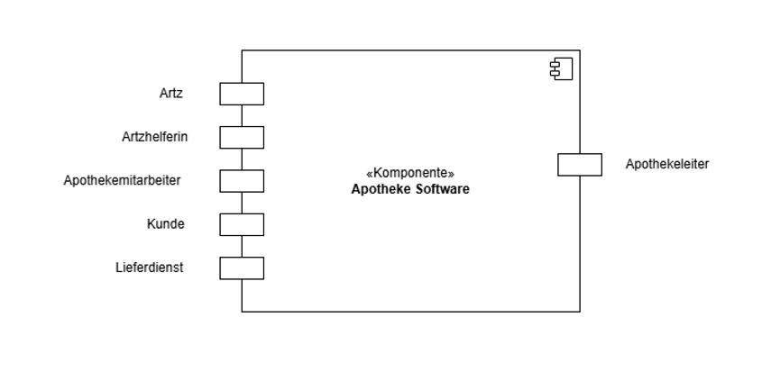
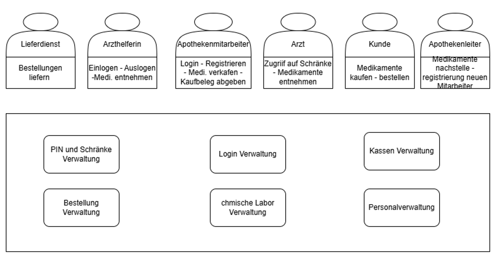

:project_name: Apotheke-Software
:toc: left
:numbered:
:toc-title: Inhaltsverzeichnis
= Pflichtenheft __{project_name}__

[options="header"]
[cols="1, 1, 1, 1, 4"]
|===
|Version | Status      | Bearbeitungsdatum   | Autoren(en) |  Vermerk
|0.1     | In Arbeit   | 03.04.2025          | Hamza, Anton, Anne, Eqbal        | Initiale Version
|0.9    | In Arbeit | 14.04.2025 | Hamza, Anton, Anne, Eqbal | Nachtrag Versionierung
|===

== Zusammenfassung
* Dieses Dokument beschreibt die Anforderungen und Funktionen der webbasierten Software für eine Apotheke. 
* Die Software unterstützt den Verkauf von Medikamenten, die Verwaltung von Lagerbeständen, die Verarbeitung von Rezepten und die Abrechnung mit Krankenkassen. Ziel ist eine sichere, effiziente und benutzerfreundliche Lösung zur digitalen Verwaltung aller Apothekenprozesse.

== Aufgabenstellung und Zielsetzung

* Dem großen Unterbrunner Ärztehaus wird eine Apotheke angegliedert. Es handelt sich um 
einen Verkaufsraum mit drei Kassen und einer Selbstbedienungsabteilung für nicht 
rezeptpflichtige Waren (Pflaster, medizinische Badezusätze, Gesundheitstees aller Art, 
Pflegesalben etc.).

* Daneben gibt es ein kleines chemisches Labor, wo auf Anforderung 
der Ärzte spezielle Pulver, Salben und Tinkturen bereitet werden können (abzuholen einen 
Tag nach Bestellung).  

* Bei Bestellungen von Mixturen oder nicht vorrätigen Medikamenten werden den Kunden 
Bestellzettel mit einer eindeutigen Identifikationsnummer ausgegeben (das Rezept 
verbleibt in der Apotheke).

* Die  Apothekenschränke  sind  wie  üblich  alphabetisch  sortiert.  An  jeder  
Medikamentenpackung ist ein Strichcode angebracht, welcher das Medikament und die  
Packungsgröße eindeutig identifiziert. Bei Verkauf eines Medikaments wird der Code an 
der Kasse eingelesen.
Auf diese Weise wird der Posten auf die Kundenrechnung und 
gleichzeitig in die tägliche Nachbestellung übernommen.

* Medikamente werden entweder wie andere Waren bar bezahlt oder an Kassenpatienten 
gegen Entrichtung der Zuzahlung (10% des Preises, jedoch mindestens 5 EUR und 
maximal 10 EUR pro Arzneimittel) abgegeben. Kassenleistungen werden von den 
Apotheken mit einer Zentralkasse monatlich abgerechnet.

* Mit Hilfe der neuen Apotheke ersparen sich die Praxen auch die Bewirtschaftung eigener 
Medizinvorräte: Neben den Mitarbeitern der Apotheke haben auch die Ärzte und einige 
besonders zuverlässige Arzthelferinnen jederzeit Zugang zum Medikamentenschrank. Für 
diesen Zweck gibt es eine Tür zur Apotheke, die vom Ärztehaus aus durch Eingabe einer 
praxisspezifischen PIN geöffnet werden kann. Auf der anderen Seite der Tür befindet sich 
ein Lesegerät, an dem beim Verlassen der Strichcode der entnommenen Medikamente 
erfasst wird. Zwecks eindeutiger Zuordnung der Medikamente und um den Betrieb der 
Apotheke nicht übermäßig zu stören, hat zu einem Zeitpunkt höchstens eine Praxis 
Zugang zur Apotheke. Die Ärzte haben erklärt, dass dies keine wesentliche Einschränkung 
darstellt. Die Abrechnung mit den einzelnen Arztpraxen erfolgt monatlich.  

* Alle Lesegeräte sind an den Computer der Apotheke angeschlossen, über den die 
automatische Nachbestellung von Medikamenten, die eigene Bilanz und die Abrechnung 
mit den Ersatzkassen läuft. Außerdem wird an diesem Computer wöchentlich eine Liste 
der Medikamente ausgedruckt, deren Verfallsdatum in der nächsten Woche erreicht wird 
oder das schon überschritten ist. Diese werden wöchentlich ausgesondert.   

* Die Einführung eines weiteren Dienstes - die Auslieferung von Medikamenten an das 
nahegelegene Altersheim und andere bewegungseingeschränkte Patienten wird derzeit 
diskutiert.   

== Produktnutzung
* Die Webanwendung wird täglich von Apothekenpersonal, Ärzten und autorisierten Helfern genutzt. Sie dient als zentrale Plattform für Medikamentenverkauf, Rezeptverarbeitung, Lagerkontrolle und Abrechnung. Zudem wird sie durch Lieferdienstmitarbeiter für den Versandprozess verwendet.

== Interessensgruppen (Stakeholder)
[options="header"]
[cols="1, 4"]
|===
|Stakeholder | Interesse
|Apothekenleitung     | Effizienter Betrieb, Kontrolle über Lager und Verkauf  
|Apothekenmitarbeiter	|	Schnelle Verkaufsabwicklung, korrekte Dokumentation

|Arzt			|	Zugriff auf Medikamente, einfache PIN-Verwaltung

|Arzthelferin		|	Medikamentenentnahme für Patienten

|Patienten		|	Schnelle und sichere Versorgung mit Medikamenten

|krankenkasse		|	Korrekte Abrechnung von Kassenleistungen

|Lieferdienst	|	Zuverlässige Auslieferung und Dokumentation

|===
== Systemgrenze und Top-Level-Architektur

=== Kontextdiagramm

=== Top-Level-Architektur

== Anwendungsfälle

=== Akteure

Akteure sind die Benutzer des Software-Systems oder Nachbarsysteme, welche darauf zugreifen. Dokumentieren Sie die Akteure in einer Tabelle. Diese Tabelle gibt einen Überblick über die Akteure und beschreibt sie kurz. Die Tabelle hat also mindestens zwei Spalten (Akteur Name und Kommentar).
Weitere relevante Spalten können bei Bedarf ergänzt werden.

// See http://asciidoctor.org/docs/user-manual/#tables
[options="header"]
[cols="1,4"]
|===
|Name |Beschreibung
|...  |...
|===

=== Überblick Anwendungsfalldiagramm
Anwendungsfall-Diagramm, das alle Anwendungsfälle und alle Akteure darstellt

=== Anwendungsfallbeschreibungen
Dieser Unterabschnitt beschreibt die Anwendungsfälle. In dieser Beschreibung müssen noch nicht alle Sonderfälle und Varianten berücksichtigt werden. Schwerpunkt ist es, die wichtigsten Anwendungsfälle des Systems zu finden. Wichtig sind solche Anwendungsfälle, die für den Auftraggeber, den Nutzer den größten Nutzen bringen.
Für komplexere Anwendungsfälle ein UML-Sequenzdiagramm ergänzen.
Einfache Anwendungsfälle mit einem Absatz beschreiben.
Die typischen Anwendungsfälle (Anlegen, Ändern, Löschen) können zu einem einzigen zusammengefasst werden.

== Funktionale Anforderungen

=== Muss-Kriterien
Was das zu erstellende Programm auf alle Fälle leisten muss.

=== Kann-Kriterien
Anforderungen die das Programm leisten können soll, aber für den korrekten Betrieb entbehrlich sind.

== Nicht-Funktionale Anforderungen

=== Qualitätsziele

Dokumentieren Sie in einer Tabelle die Qualitätsziele, welche das System erreichen soll, sowie deren Priorität.

=== Konkrete Nicht-Funktionale Anforderungen

Beschreiben Sie Nicht-Funktionale Anforderungen, welche dazu dienen, die zuvor definierten Qualitätsziele zu erreichen.
Achten Sie darauf, dass deren Erfüllung (mindestens theoretisch) messbar sein muss.

== GUI Prototyp

In diesem Kapitel soll ein Entwurf der Navigationsmöglichkeiten und Dialoge des Systems erstellt werden.
Idealerweise entsteht auch ein grafischer Prototyp, welcher dem Kunden zeigt, wie sein System visuell umgesetzt werden soll.
Konkrete Absprachen - beispielsweise ob der grafische Prototyp oder die Dialoglandkarte höhere Priorität hat - sind mit dem Kunden zu treffen.

=== Überblick: Dialoglandkarte
Erstellen Sie ein Übersichtsdiagramm, das das Zusammenspiel Ihrer Masken zur Laufzeit darstellt. Also mit welchen Aktionen zwischen den Masken navigiert wird.
//Die nachfolgende Abbildung zeigt eine an die Pinnwand gezeichnete Dialoglandkarte. Ihre Karte sollte zusätzlich die Buttons/Funktionen darstellen, mit deren Hilfe Sie zwischen den Masken navigieren.

=== Dialogbeschreibung
Für jeden Dialog:

1. Kurze textuelle Dialogbeschreibung eingefügt: Was soll der jeweilige Dialog? Was kann man damit tun? Überblick?
2. Maskenentwürfe (Screenshot, Mockup)
3. Maskenelemente (Ein/Ausgabefelder, Aktionen wie Buttons, Listen, …)
4. Evtl. Maskendetails, spezielle Widgets

== Datenmodell

=== Überblick: Klassendiagramm
UML-Analyseklassendiagramm

=== Klassen und Enumerationen
Dieser Abschnitt stellt eine Vereinigung von Glossar und der Beschreibung von Klassen/Enumerationen dar. Jede Klasse und Enumeration wird in Form eines Glossars textuell beschrieben. Zusätzlich werden eventuellen Konsistenz- und Formatierungsregeln aufgeführt.

// See http://asciidoctor.org/docs/user-manual/#tables
[options="header"]
|===
|Klasse/Enumeration |Beschreibung |
|…                  |…            |
|===

== Akzeptanztestfälle
Mithilfe von Akzeptanztests wird geprüft, ob die Software die funktionalen Erwartungen und Anforderungen im Gebrauch
erfüllt.
Diese sollen und können aus den Anwendungsfallbeschreibungen und den UML-Sequenzdiagrammen abgeleitet werden.
D.h., pro (komplexen) Anwendungsfall gibt es typischerweise mindestens ein Sequenzdiagramm (, welches ein
Szenarium beschreibt). Für jedes Szenarium sollte es einen Akzeptanztestfall geben. Listen Sie alle Akzeptanztestfälle in tabellarischer Form auf.
Jeder Testfall soll mit einer ID versehen werde, um später zwischen den Dokumenten (z.B. im Test-Plan) referenzieren zu können.

== Glossar
Sämtliche Begriffe, die innerhalb des Projektes verwendet werden und deren gemeinsames Verständnis aller beteiligten
Stakeholder essenziell ist, sollten hier aufgeführt werden.
Insbesondere Begriffe der zu implementierenden Domäne wurden bereits beschrieben, jedoch gibt es meist mehr Begriffe, die einer Beschreibung bedürfen. +
Beispiel: Was bedeutet "Kunde"? Ein Nutzer des Systems? Der Kunde des Projektes (Auftraggeber)?

== Offene Punkte
Offene Punkte werden entweder direkt in der Spezifikation notiert. Wenn das Pflichtenheft zum finalen Review vorgelegt wird, sollte es keine offenen Punkte mehr geben.
