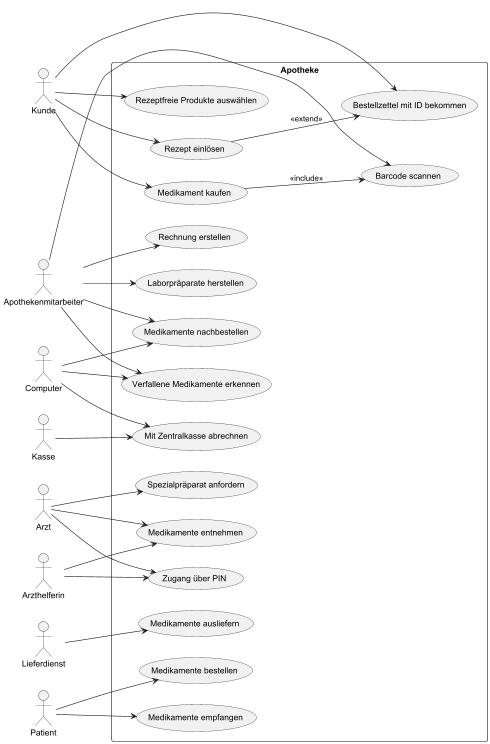
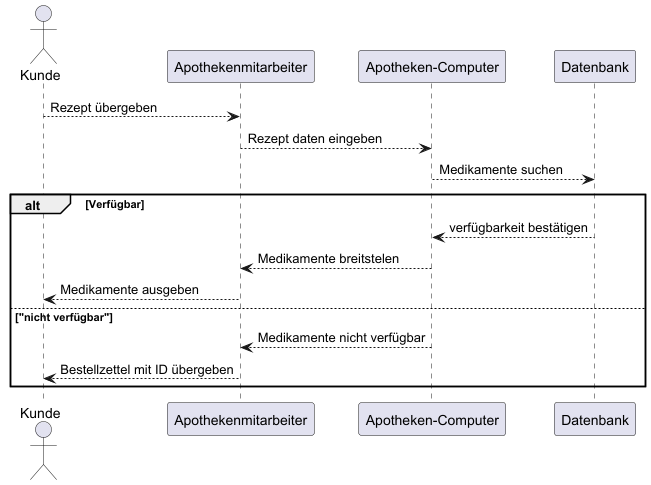

:project_name: Name des Projekts
:toc: left
:numbered:
= Pflichtenheft __{project_name}__

[options="header"]
[cols="1, 1, 1, 1, 4"]
|===
|Version | Status      | Bearbeitungsdatum   | Autoren(en) |  Vermerk
|0.1     | In Arbeit   | 01.04.2023          | Autor       | Initiale Version
|===

== Inhaltsverzeichnis
Dieses Dokument benötigt ein Inhaltsverzeichnis. Es existieren mehrere Einbindungsmöglichkeiten.

== Zusammenfassung
Eine kurze Beschreibung des Dokuments. Wenige Absätze.

== Aufgabenstellung und Zielsetzung
Text aus Aufgabenstellung kopieren und ggfs. präzisieren.
Insbesondere ergänzen, welche Ziele mit dem Abschluss des Projektes erreicht werden sollen.

== Produktnutzung
In welchem Kontext soll das System später genutzt werden? Welche Rahmenbedingungen gelten?
Zusätzlich kurze Einleitung für fachfremde Personen

== Interessensgruppen (Stakeholder)
Welche realen und juristischen Personen(-gruppen) haben Einfluss auf die Anforderungen im Projekt?

== Systemgrenze und Top-Level-Architektur

=== Kontextdiagramm
Das Kontextdiagramm zeigt das geplante Software-System in seiner Umgebung. Zur Umgebung gehören alle Nutzergruppen des Systems und Nachbarsysteme. Die Grafik kann auch informell gehalten sein. Überlegen Sie sich dann geeignete Symbole. Die Grafik kann beispielsweise mit Visio erstellt werden. Wenn nötig, erläutern Sie diese Grafik.

=== Top-Level-Architektur
Dokumentieren Sie ihre Top-Level-Architektur mit Hilfe eines Komponentendiagramm.

== Anwendungsfälle

=== Akteure
Die folgende Tabelle dokumentiert die Akteure des Apothekensystems basierend auf der Aufgabenstellung.
// See http://asciidoctor.org/docs/user-manual/#tables
[cols="1,3", options="header"]
|===
|Name des Akteurs |Beschreibung

|Kunde |Holt Medikamente an der Kasse ab, kann rezeptfreie Produkte selbst auswählen.
|Arzt |Bestellt Spezialpräparate im Labor, hat Zugang zum Medikamentenschrank.
|Arzthelferin |Verlässliche Arzthelferinnen haben Zugang zur Apotheke für die Arztpraxis.
|Apothekenmitarbeiter |Bedient Kunden, verwaltet Lager, führt Laborarbeiten durch.
|Kassensystem / Scanner |Erfasst Barcode, löst Bestellungen aus, erstellt Rechnungen.
|Zentralkasse |Empfängt monatliche Abrechnungen der Kassenpatienten.
|Apotheken-Computer |Zentrale Steuerung für Nachbestellungen, Bilanz, Ablaufkontrolle.
|Labor |Bereitet individuelle Salben und Mischungen nach Arztanfrage.
|Altersheim (zukünftig) |Empfänger von Medikamenten im geplanten Auslieferservice.
|Lieferservice / Bote |Bringt Medikamente zu Altenheim oder immobilen Patienten.
|Patient (nicht mobil) |Empfängt Medikamente über den Lieferservice, z. B. im Altersheim.
|===

=== Überblick Anwendungsfalldiagramm

=== Anwendungsfallbeschreibungen
7.3 Anwendungsfallbeschreibungen
Im Folgenden werden die wichtigsten Anwendungsfälle des Apothekensystems beschrieben. Einfache Anwendungsfälle werden kurz dargestellt, komplexere in mehreren Schritten (mit Konsequenz Diagramm erklärt).
Überblick
Im Mittelpunkt des Systems steht die Apotheke. Sie bietet eine Vielzahl von Funktionen, die von verschiedenen Akteuren genutzt werden. Das Diagramm zeigt insbesondere:
- Einkauf und Abgabe von Medikamenten durch Kunden, einschließlich rezeptfreier und verschreibungspflichtiger Arzneimittel.
- Erweiterte medizinische Prozesse wie das Anfordern und Herstellen von Spezialpräparaten durch medizinisches Personal.
- Interne Verwaltung wie die Nachbestellung, Abrechnung und das Erkennen von verfallenen Medikamenten.
- Externe Abläufe wie die Medikamentenauslieferung an nicht mobile Patienten.

Wichtige Anwendungsfälle:

Medikament kaufen (Kunde)
Der Kunde wählt rezeptfreie oder rezeptpflichtige Medikamente aus. An der Kasse wird der Strichcode gescannt, der Preis berechnet und die Medikamente bezahlt. Für Kassenpatienten erfolgt die Abgabe mit Zuzahlung und späterer Abrechnung mit der Zentralkasse.
Rezept einlösen (Kunde)
Der Kunde übergibt das Rezept an den Apothekenmitarbeiter. Falls das Medikament verfügbar ist, wird es sofort ausgegeben. Ist es nicht vorrätig, erhält der Kunde einen Bestellzettel mit eindeutige
Spezialpräparat anfordern (Arzt)

image::../../../PlantUML-Test/sequence_1.png[width=651]
Der Arzt fordert im Labor eine individuelle Mischung an (z. B. Salbe, Pulver). Diese wird vom Apothekenmitarbeiter im Labor hergestellt und ist am Folgetag abholbereit.
Zugang über PIN und Entnahme (Arzt / Arzthelferin)
1.	Der Arzt oder eine berechtigte Arzthelferin gibt eine praxisbezogene PIN ein, um Zugang zur Apotheke zu erhalten.
2. Die Tür öffnet sich, sofern keine andere Praxis gleichzeitig Zugriff hat.
3. Beim Verlassen werden Medikamente gescannt, damit sie korrekt zugeordnet werden.
4. Die Abrechnung mit der Arztpraxis erfolgt monatlich.

Medikamente nachbestellen (Computer, Scanner)
Beim Scannen eines Medikaments wird es automatisch zur Nachbestellung markiert. Die Bestellung wird täglich vom Apotheken-Computer verwaltet und ausgelöst.
Verfallene Medikamente erkennen (Computer)
Der Computer erstellt wöchentlich eine Liste aller Medikamente, deren Verfallsdatum erreicht ist. Diese Medikamente werden aussortiert.
Abrechnung mit Zentralkasse (Computer / Kasse)
Kassenpatienten zahlen nur den Zuzahlungsbetrag. Die restliche Summe wird über die monatliche Sammelabrechnung mit der Zentralkasse verrechnet.
Medikamente ausliefern (Lieferdienst)
Der Lieferdienst bringt bestellte Medikamente zum Altersheim oder an Patienten, die nicht selbst zur Apotheke kommen.
Medikamente empfangen (Patient nicht mobil)
Ein bewegungseingeschränkter Patient erhält Medikamente durch den Lieferservice direkt nach Hause oder ins Heim.

== Funktionale Anforderungen

=== Muss-Kriterien
Was das zu erstellende Programm auf alle Fälle leisten muss.

=== Kann-Kriterien
Anforderungen die das Programm leisten können soll, aber für den korrekten Betrieb entbehrlich sind.

== Nicht-Funktionale Anforderungen

=== Qualitätsziele

Dokumentieren Sie in einer Tabelle die Qualitätsziele, welche das System erreichen soll, sowie deren Priorität.

=== Konkrete Nicht-Funktionale Anforderungen

Beschreiben Sie Nicht-Funktionale Anforderungen, welche dazu dienen, die zuvor definierten Qualitätsziele zu erreichen.
Achten Sie darauf, dass deren Erfüllung (mindestens theoretisch) messbar sein muss.

== GUI Prototyp

In diesem Kapitel soll ein Entwurf der Navigationsmöglichkeiten und Dialoge des Systems erstellt werden.
Idealerweise entsteht auch ein grafischer Prototyp, welcher dem Kunden zeigt, wie sein System visuell umgesetzt werden soll.
Konkrete Absprachen - beispielsweise ob der grafische Prototyp oder die Dialoglandkarte höhere Priorität hat - sind mit dem Kunden zu treffen.

=== Überblick: Dialoglandkarte
Erstellen Sie ein Übersichtsdiagramm, das das Zusammenspiel Ihrer Masken zur Laufzeit darstellt. Also mit welchen Aktionen zwischen den Masken navigiert wird.
//Die nachfolgende Abbildung zeigt eine an die Pinnwand gezeichnete Dialoglandkarte. Ihre Karte sollte zusätzlich die Buttons/Funktionen darstellen, mit deren Hilfe Sie zwischen den Masken navigieren.

=== Dialogbeschreibung
Für jeden Dialog:

1. Kurze textuelle Dialogbeschreibung eingefügt: Was soll der jeweilige Dialog? Was kann man damit tun? Überblick?
2. Maskenentwürfe (Screenshot, Mockup)
3. Maskenelemente (Ein/Ausgabefelder, Aktionen wie Buttons, Listen, …)
4. Evtl. Maskendetails, spezielle Widgets

== Datenmodell

=== Überblick: Klassendiagramm
UML-Analyseklassendiagramm

=== Klassen und Enumerationen
Dieser Abschnitt stellt eine Vereinigung von Glossar und der Beschreibung von Klassen/Enumerationen dar. Jede Klasse und Enumeration wird in Form eines Glossars textuell beschrieben. Zusätzlich werden eventuellen Konsistenz- und Formatierungsregeln aufgeführt.

// See http://asciidoctor.org/docs/user-manual/#tables
[options="header"]
|===
|Klasse/Enumeration |Beschreibung |
|…                  |…            |
|===

== Akzeptanztestfälle
Mithilfe von Akzeptanztests wird geprüft, ob die Software die funktionalen Erwartungen und Anforderungen im Gebrauch
erfüllt.
Diese sollen und können aus den Anwendungsfallbeschreibungen und den UML-Sequenzdiagrammen abgeleitet werden.
D.h., pro (komplexen) Anwendungsfall gibt es typischerweise mindestens ein Sequenzdiagramm (, welches ein
Szenarium beschreibt). Für jedes Szenarium sollte es einen Akzeptanztestfall geben. Listen Sie alle Akzeptanztestfälle in tabellarischer Form auf.
Jeder Testfall soll mit einer ID versehen werde, um später zwischen den Dokumenten (z.B. im Test-Plan) referenzieren zu können.

== Glossar
Sämtliche Begriffe, die innerhalb des Projektes verwendet werden und deren gemeinsames Verständnis aller beteiligten
Stakeholder essenziell ist, sollten hier aufgeführt werden.
Insbesondere Begriffe der zu implementierenden Domäne wurden bereits beschrieben, jedoch gibt es meist mehr Begriffe, die einer Beschreibung bedürfen. +
Beispiel: Was bedeutet "Kunde"? Ein Nutzer des Systems? Der Kunde des Projektes (Auftraggeber)?

== Offene Punkte
Offene Punkte werden entweder direkt in der Spezifikation notiert. Wenn das Pflichtenheft zum finalen Review vorgelegt wird, sollte es keine offenen Punkte mehr geben.
