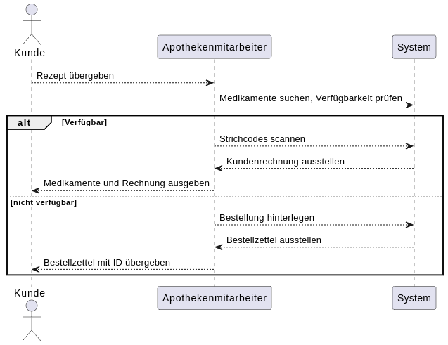

:project_name: Name des Projekts
:toc: left
:numbered:
= Pflichtenheft __{project_name}__

[options="header"]
[cols="1, 1, 1, 1, 4"]
|===
|Version | Status      | Bearbeitungsdatum   | Autoren(en) |  Vermerk
|0.1     | In Arbeit   | 01.04.2023          | Autor       | Initiale Version
|===

== Inhaltsverzeichnis
Dieses Dokument benötigt ein Inhaltsverzeichnis. Es existieren mehrere Einbindungsmöglichkeiten.

== Zusammenfassung
Eine kurze Beschreibung des Dokuments. Wenige Absätze.

== Aufgabenstellung und Zielsetzung
Text aus Aufgabenstellung kopieren und ggfs. präzisieren.
Insbesondere ergänzen, welche Ziele mit dem Abschluss des Projektes erreicht werden sollen.

== Produktnutzung
In welchem Kontext soll das System später genutzt werden? Welche Rahmenbedingungen gelten?
Zusätzlich kurze Einleitung für fachfremde Personen

== Interessensgruppen (Stakeholder)
Welche realen und juristischen Personen(-gruppen) haben Einfluss auf die Anforderungen im Projekt?

== Systemgrenze und Top-Level-Architektur

=== Kontextdiagramm
Das Kontextdiagramm zeigt das geplante Software-System in seiner Umgebung. Zur Umgebung gehören alle Nutzergruppen des Systems und Nachbarsysteme. Die Grafik kann auch informell gehalten sein. Überlegen Sie sich dann geeignete Symbole. Die Grafik kann beispielsweise mit Visio erstellt werden. Wenn nötig, erläutern Sie diese Grafik.

=== Top-Level-Architektur
Dokumentieren Sie ihre Top-Level-Architektur mit Hilfe eines Komponentendiagramm.

== Anwendungsfälle

=== Akteure
Die folgende Tabelle dokumentiert die Akteure des Apothekensystems basierend auf der Aufgabenstellung.
// See http://asciidoctor.org/docs/user-manual/#tables
[cols="1,3", options="header"]
|===
|*Name des Akteurs* |*Beschreibung*

|Kunde
|
1. Holt Medikamente an der Kasse ab. +
2. kann rezeptfreie Produkte selbst auswählen.

|Arzt
|
1. Bestellt Spezialpräparate im Labor. +
2. Hat Zugang zum Medikamentenschrank.

|Arzthelferin |Verlässliche Arzthelferinnen haben Zugang zur Apotheke für die Arztpraxis.

|Apothekenmitarbeiter
|
1. Bedient Kunden. +
2. Verwaltet Lager +
3. Führt Laborarbeiten durch.

|Apothekenleiter |
1. Zentrale Steuerung für Nachbestellungen +
2. Bilanz +
3. Ablaufkontrolle

|Lieferdienst
|Bringt Medikamente zu Altenheim oder immobilen Patienten.

|===

=== Überblick Anwendungsfalldiagramm
image::models/analysis/use-cases/usecase.png[]

=== Anwendungsfallbeschreibungen

Im Mittelpunkt des Systems steht die Apotheke. Sie bietet eine Vielzahl von Funktionen, die von verschiedenen Akteuren genutzt werden.
Das Diagramm zeigt insbesondere:

1. Einkauf und Abgabe von Medikamenten durch Kunden, einschließlich rezeptfreier und verschreibungspflichtiger Arzneimittel.

2. Erweiterte medizinische Prozesse wie das Anfordern und Herstellen von Spezialpräparaten durch medizinisches Personal.

3. Interne Verwaltung wie die Nachbestellung, Abrechnung und das Erkennen von verfallenen Medikamenten.

4. Externe Abläufe wie die Medikamentenauslieferung an nicht mobile Patienten.

*Wichtige Anwendungsfälle:*
[cols="1,4", options="header"]
|===
|ID | UC001
|Name | Rezept einlösen
|Beschreibung | Der Kunde gibt ein ärztliches Rezept beim Apothekenmitarbeiter ab. Das Medikament wird direkt ausgegeben oder – falls nicht vorrätig – für eine spätere Abholung vorgemerkt.
|Rollen | Kunde, Apothekenmitarbeiter
|Auslöser | Kunde übergibt ein gültiges Rezept an die Apotheke
|Voraussetzungen | Das Rezept ist gültig und das Medikament ist im System hinterlegt
|Grundlegende Schritte |
1. Kunde übergibt das Rezept an den Apothekenmitarbeiter +
2. Apothekenmitarbeiter scannt das Rezept oder gibt es manuell ein +
3. System prüft die Verfügbarkeit des Medikaments +
4. Falls vorhanden: Medikament wird direkt ausgegeben +
5. Falls nicht vorhanden: Kunde erhält einen Bestellzettel mit ID +
6. Bei Kassenpatienten: Zuzahlung wird berechnet +
7. System speichert die Ausgabe für die spätere Abrechnung mit der Zentralkasse

|Funktionale Anforderungen | [F000], [F000]
|===

[cols="1,4", options="header"]
|===
|ID | UC002
|Name | Medikamente nachbestellen
|Beschreibung | Beim Scannen eines Medikaments erkennt das System, dass der Bestand niedrig ist. Die Nachbestellung wird automatisch vorgemerkt und vom Apotheken-Computer ausgelöst.
|Rollen | Apothekenmitarbeiter, Apothekenleiter
|Auslöser | Ein Medikament wird verkauft; täglich
|Voraussetzungen | Das Medikament ist im System hinterlegt und hat einen definierten Mindestbestand
|Grundlegende Schritte |
1. Apothekenmitarbeiter scannt und verkauft ein Medikament +
2. System erkennt, dass der Lagerbestand unter dem Mindestwert liegt +
3. Medikament wird zur Nachbestellung vorgemerkt +
4. Apotheken-Computer übernimmt und löst automatisch eine Bestellung beim Lieferanten aus +
5. Bestellung wird im System dokumentiert

|Funktionale Anforderungen | [F000], [F000]
|===

[cols="1,4", options="header"]
|===
|ID | UC003
|Name | Zugang über PIN (bzw. Passwort)
|Beschreibung | Arzt oder Arzthelferin gibt eine praxisbezogene PIN ein, um Zugang zur Apotheke zu erhalten. Die Tür öffnet sich nur, wenn keine andere Praxis gleichzeitig Zugriff hat.
|Rollen | Arzt, Arzthelferin
|Auslöser | Medizinisches Personal benötigt Zugang zu Medikamentenschrank oder Lager
|Voraussetzungen | Gültige PIN vorhanden, keine andere Praxis greift gleichzeitig zu
|Grundlegende Schritte |
1. Arzt oder Arzthelferin gibt PIN in das Zugangssystem ein +
2. System überprüft die Berechtigung und gleichzeitige Zugriffe +
3. Bei erfolgreicher Prüfung öffnet sich die Tür zur Apotheke +
4. Medikamente werden entnommen +
5. System registriert den Zugriff und ordnet die Entnahme der richtigen Praxis zu

|Funktionale Anforderungen | [F000], [F000]
|===

image::models/analysis/use-cases/sequence_1.png[]

[cols="1,4", options="header"]
|===
|ID | UC004
|Name | Verfallene Medikamente erkennen
|Beschreibung | Das System prüft in regelmäßigen Abständen, ob sich abgelaufene Medikamente im Bestand befinden, erstellt eine Liste und informiert den Apothekenmitarbeiter.
|Rollen | Apothekenleiter, Apothekenmitarbeiter
|Auslöser | Automatisierte wöchentliche Systemprüfung
|Voraussetzungen | Lagerdaten und Verfallsdaten der Medikamente sind im System erfasst
|Grundlegende Schritte |
1. Apotheken-Computer startet automatisch die Prüfung aller Medikamentenbestände +
2. System vergleicht das aktuelle Datum mit den Verfallsdaten +
3. Eine Liste aller abgelaufenen Medikamente wird erstellt +
4. Apothekenmitarbeiter erhält die Liste zur weiteren Bearbeitung +
5. Verfallene Medikamente werden aus dem Lager entfernt

|Funktionale Anforderungen | [F000], [F000]
|===

[cols="1,4", options="header"]
|===
|ID | UC005
|Name | Abrechnung mit Zentralkasse
|Beschreibung | Die Apotheke erstellt am Monatsende automatisch eine Sammelabrechnung aller Kassenpatienten. Diese wird an die Zentralkasse übermittelt, die die Zahlungen bestätigt.
|Rollen | Apothekenleiter
|Auslöser | Monatsende wird vom System erkannt
|Voraussetzungen | Alle Kassenvorgänge und Patientendaten wurden korrekt erfasst
|Grundlegende Schritte |
1. Die Anwendung sammelt alle Kassenvorgänge über den Monat +
2. Am Monatsende wird automatisch eine Sammelabrechnung erstellt +
3. Die Abrechnung wird an die Krankenkasse übermittelt

|Funktionale Anforderungen | [F000], [F00]
|===

[cols="1,4", options="header"]
|===
|ID | UC006
|Name | Spezialpräparat anfordern
|Beschreibung | Der Arzt oder der Kunde fordert ein spezielles Präparat (z. B. eine individuelle Salbe) an. Der Apothekenmitarbeiter nimmt den Auftrag auf und stellt das Präparat im Laborbereich der Apotheke selbst her.
|Rollen | Arzt, Apothekenmitarbeiter, Apothekenleiter
|Auslöser | Arzt benötigt ein individuelles Spezialpräparat
|Voraussetzungen | Arzt ist berechtigt, Spezialpräparate zu bestellen
|Grundlegende Schritte |
1. Arzt oder Kunde fordert ein Spezialpräparat (eine Mixtur) an +
2. Apothekenmitarbeiter erfasst die Anforderung im System +
3. Apothekenmitarbeiter stellt für den Arzt/den Kunden ein Bestellzettel aus.
4. Apothekenmitarbeiter stellt das Präparat im Laborbereich her +
5. Apothekenmitarbeiter markiert die Bestellung als "abholbereit"

|Funktionale Anforderungen | [F00], [F00]
|===

[cols="1,4", options="header"]
|===
|ID | UC007
|Name | Medikamente ausliefern
|Beschreibung | Der Lieferdienst bringt bestellte Medikamente an nicht mobile Patienten oder an Altenheime. Die Lieferung erfolgt nach Planung und Verpackung durch die Apotheke.
|Rollen | Lieferdienst, Kunde (Patient), Apothekenmitarbeiter
|Auslöser | Eine Medikamentenbestellung zur Auslieferung liegt vor
|Voraussetzungen | Medikamente sind verfügbar und eine gültige Lieferadresse ist im System gespeichert
|Grundlegende Schritte |
1. Bestellung wird vom Apothekenmitarbeiter im System registriert +
2. Lieferung wird im System geplant (Route, Adresse) +
3. Medikamente werden für den Versand vorbereitet und verpackt +
4. Lieferdienst übernimmt die Sendung und liefert an die Zieladresse +
5. Patient erhält Medikamente

|Funktionale Anforderungen | [F00], [F00]
|===

[cols="1,4", options="header"]
|===
|ID | UC008
|Name | Medikament kaufen
|Beschreibung | Der Kunde kauft rezeptfreie oder rezeptpflichtige Medikamente an der Kasse. Das Kassensystem scannt die Produkte, berechnet den Preis und verarbeitet die Zahlung. Bei Kassenpatienten erfolgt eine automatische Abrechnung mit der Zentralkasse.
|Rollen | Kunde, Apothekenmitarbeiter
|Auslöser | Kunde legt Medikamente zur Bezahlung vor
|Voraussetzungen | Medikamente sind im System vorhanden und vorrätig
|Grundlegende Schritte |
1. Kunde wählt Medikamente aus und geht zur Kasse +
2. Kassensystem scannt die Barcodes der Medikamente +
3. System berechnet Gesamtpreis +
4. Kunde bezahlt (bar oder über die Krankenkasse) +
5. Bei Kassenpatienten: Zuzahlung wird kassiert, Rest an Zentralkasse gemeldet +
6. Kundenrechnung wird erstellt und übergeben

|Funktionale Anforderungen | [F00], [F00]
|===

== Funktionale Anforderungen

=== Muss-Kriterien
[options="header", cols="2h, 1, 3, 12"]
|===
|ID
|Version
|Name
|Beschreibung

|[[F1]]<<F1>>
|v0.1
|Authentifizierung
a|
Nutzer, die ein Konto haben, müssen in der Lage sein, sich bei der Anwendung anzumelden. Dafür wird der Nutzername und das Passwort benötigt.

|[[F2]]<<F2>>
|v0.1
|Logout
a|
Der Nutzer muss sich jederzeit abmelden können.

|[[F3]]<<F3>>
|v0.1
|Nutzerrollen
a|
Die Anwendung muss verschiedene Nutzerrollen (Apothekenleiter, Apothekenmitarbeiter, Arzt/Arzthelfer, Lieferdienst, Kunde) mit entsprechenden Berechtigungen unterstützen.

|[[F4]]<<F4>>
|v0.1
|Selbstbedienungskasse
a|
Nicht-authentifizierte Nutzer müssen in der Lage sein, die Selbstbedienungskasse als Kunden zu benutzen.

|[[F5]]<<F5>>
|v0.1
|Registrierung
a|
Nicht-authentifizierte Nutzer müssen in der Lage sein, sich bei der Anwendung mit den folgenden Informaitonen zu registrieren:

- Name
- Vorname
- Nutzername
- Rolle
- Passwort

Neu erstellte Konten müssen durch die Apothekenmitarbeiter genehmigt werden, bevor der Nutzer sich einloggen kann.

|[[F6]]<<F6>>
|v0.1
|Verkauf von Waren
a|
Die Apothekenmitarbeiter müssen in der Lage sein, Waren zu verkaufen. Die Kunden müssen nicht rezeptpflichtige Waren auch über die SB-Kasse kaufen können.

|[[F7]]<<F7>>
|v0.1
|Strichcode scannen
a|
Kunden, Apothekenmitarbeiter und Ärzte müssen Strichcodes scannen bzw. eingeben können. Auf diese Weise wird der Posten auf die Kundenrechnung übernommen.

|[[F8]]<<F8>>
|v0.1
|Mixtur bestellen
a|
Die Kunden und Ärzte müssen in der Lage sein, spezielle Pulver, Salben und Tinkturen zu bestellen, indem sie die Zutaten und deren Mengen angeben.

|[[F9]]<<F9>>
|v0.1
|Mixturpreis berechnen
a|
Das System muss den Preis von Mixturen automatisch berechnen.

**Formel:** Menge × Preis pro Gramm + 10% Marge

|[[F10]]<<F10>>
|v0.1
|Kundenrechnung ausstellen
a|
Nach einem erfolgreich abgeschlossenen Kauf soll der Apothekenmitarbeiter bzw. die SB-Kasse eine Kundenrechnung ausstellen.

|[[F11]]<<F11>>
|v0.1
|Eigene Bilanz erfassen
a|
Das System muss die Medikamentenbestände erfassen.

|[[F12]]<<F12>>
|v0.1
|Verfallende Medikamente einsehen
a|
Das System muss eine Liste der Medikamente auszudrucken, deren Verfallsdatum in der nächsten Woche erreicht wird oder das schon überschritten ist

|[[F13]]<<F13>>
|v0.1
|Zahlungsarten
a|
Kunden müssen in der Lage sein, die Waren entweder bar zu bezahlen oder von der Krankenkasse (gegen Zuzahlung, 10% des Preises, jedoch mindestens 5 EUR und maximal 10 EUR pro Arzneimittel) bezahlen zu lassen.

|[[F14]]<<F14>>
|v0.1
|Bestellzettel
a|
Bei Bestellungen von Mixturen oder nicht vorrätigen Medikamenten werden den Kunden Bestellzettel mit einer eindeutigen Identifikationsnummer ausgegeben. Die Waren sind einen Tag nach Bestellung abzuholen.

|[[F15]]<<F15>>
|v0.1
|Bestellungen verwalten
a|
Die Apothekenmitarbeiter müssen in der Lage sein, Bestellungen einzusehen und als "abholbereit" zu markieren.

|[[F16]]<<F16>>
|v0.1
|Monatliche Abrechnung
a|
Das System soll Abrechnungen für Krankenkassen und Arztpraxen auszustellen.

|[[F17]]<<F17>>
|v0.1
|Tägliche Nachbestellung
a|
Die Anwendung muss täglich eine Liste von nachzubestellenden Medikamenten erzeugen.

|===

=== Kann-Kriterien
[options="header", cols="2h, 1, 3, 12"]
|===
|ID
|Version
|Name
|Beschreibung

|[[F18]]<<F18>>
|v0.1
|Lieferung bestellen
a|
Der Kunde soll in der Lage sein, die bestellten Medikamente liefern zu lassen.

|[[F19]]<<F19>>
|v0.1
|Auszuliefernde Medikamente anzeigen lassen
a|
Das System soll Medikamente anzeigen, die am gegebenen Tag durch den Lieferdienst auszuliefern sind.

|[[F20]]<<F20>>
|v0.1
|Route erstellen
a|
Das System soll täglich einen Routenplan für den Lieferdienst erzeugen.

|===

== Nicht-Funktionale Anforderungen

=== Qualitätsziele

////
Dokumentieren Sie in einer Tabelle die Qualitätsziele, welche das System erreichen soll, sowie deren Priorität. 
////

[cols="1,1,3", options="header"]
|===
| Qualitätsziel         | Priorität | Beschreibung / Begründung
| Korrektheit | Hoch      | Fehler bei der Preisberechnung, Zuzahlung, Bestandsführung oder Abrechnung können finanzielle Verluste oder falsche Medikamentenabgaben zur Folge haben. Datenintegrität ist essenziell.
| Sicherheit            | Hoch      | Schutz vor unbefugtem Zugriff auf Medikamente (PIN-System), Schutz von Abrechnungsdaten und potenziell sensiblen Bestelldaten ist zwingend erforderlich.
| Nutzbarkeit         | Hoch      | Das System wird täglich von verschiedenen Mitarbeitern (Verkauf, Labor, Ärzte) genutzt. Eine effiziente und fehlerarme Bedienung ist für den reibungslosen Betriebsablauf kritisch.
| Performance | Mittel    | Schnelle Reaktionen bei Standardvorgängen (Kasse, Bestandsabfrage) sind wichtig für die Nutzerakzeptanz und den Workflow, aber leichte Verzögerungen bei komplexen Berichten könnten tolerierbar sein.
| Wartbarkeit / Erweiterbarkeit | Mittel    | Das System sollte für Fehlerbehebungen zugänglich sein und zukünftige Anpassungen (z.B. Lieferservice-Integration) ermöglichen, um langfristig nutzbar zu bleiben.
|===

=== Konkrete Nicht-Funktionale Anforderungen
////
Beschreiben Sie Nicht-Funktionale Anforderungen, welche dazu dienen, die zuvor definierten Qualitätsziele zu erreichen.
Achten Sie darauf, dass deren Erfüllung (mindestens theoretisch) messbar sein muss.
////

[options="header", cols="1h, 1, 4, 7"]
|===
|ID
|Version
|Name
|Description

|[[NF1]]<<NF1>>
|v1.0
|Korrektheit - Zuzahlungsberechnung
a|
Die Berechnung der Zuzahlung für Kassenpatienten muss exakt gemäß den Regeln erfolgen: 10% des Preises, mindestens 5 EUR, maximal 10 EUR pro Arzneimittel.

|[[NF2]]<<NF2>>
|v1.0
|Korrektheit - Konsistente Bestandsführung
a|
Jede relevante Bestandsänderung (Verkauf, Entnahme durch Arztpraxis, Aussonderung, Wareneingang) muss sich sofort und korrekt im Systembestand niederschlagen.

|[[NF3]]<<NF3>>
|v1.0
|Performance - Reaktionszeit Kasse/Entnahme
a|
Die Anzeige der Artikelinformationen nach dem Einscannen eines Barcodes an der Kasse oder am Praxisausgang muss für den Benutzer gefühlt unmittelbar, technisch messbar in 95% der Fälle in unter 1,5 Sekunden erfolgen.

|[[NF4]]<<NF4>>
|v1.0
|Sicherheit - Passwort-Speicherung
a|
Passwörter für Benutzerkonten dürfen im System ausschließlich als gesalteter Hash-Wert unter Verwendung eines anerkannten, sicheren Hashing-Algorithmus (z.B. bcrypt, Argon2) gespeichert werden.

|[[NF5]]<<NF5>>
|v0.1
|Nutzbarkeit - Uptime
a|
Das System soll von 7 Uhr bis 21 Uhr mit 99%-iger Wahrscheinlichkeit verfügbar sein

|===

== GUI Prototyp

In diesem Kapitel soll ein Entwurf der Navigationsmöglichkeiten und Dialoge des Systems erstellt werden.
Idealerweise entsteht auch ein grafischer Prototyp, welcher dem Kunden zeigt, wie sein System visuell umgesetzt werden soll.
Konkrete Absprachen - beispielsweise ob der grafische Prototyp oder die Dialoglandkarte höhere Priorität hat - sind mit dem Kunden zu treffen.

=== Überblick: Dialoglandkarte
Erstellen Sie ein Übersichtsdiagramm, das das Zusammenspiel Ihrer Masken zur Laufzeit darstellt. Also mit welchen Aktionen zwischen den Masken navigiert wird.
//Die nachfolgende Abbildung zeigt eine an die Pinnwand gezeichnete Dialoglandkarte. Ihre Karte sollte zusätzlich die Buttons/Funktionen darstellen, mit deren Hilfe Sie zwischen den Masken navigieren.

=== Dialogbeschreibung
Für jeden Dialog:

1. Kurze textuelle Dialogbeschreibung eingefügt: Was soll der jeweilige Dialog? Was kann man damit tun? Überblick?
2. Maskenentwürfe (Screenshot, Mockup)
3. Maskenelemente (Ein/Ausgabefelder, Aktionen wie Buttons, Listen, …)
4. Evtl. Maskendetails, spezielle Widgets

== Datenmodell

=== Überblick: Klassendiagramm
UML-Analyseklassendiagramm

=== Klassen und Enumerationen
Dieser Abschnitt stellt eine Vereinigung von Glossar und der Beschreibung von Klassen/Enumerationen dar. Jede Klasse und Enumeration wird in Form eines Glossars textuell beschrieben. Zusätzlich werden eventuellen Konsistenz- und Formatierungsregeln aufgeführt.

// See http://asciidoctor.org/docs/user-manual/#tables
[options="header"]
|===
|Klasse/Enumeration |Beschreibung |
|…                  |…            |
|===

== Akzeptanztestfälle
Mithilfe von Akzeptanztests wird geprüft, ob die Software die funktionalen Erwartungen und Anforderungen im Gebrauch
erfüllt.
Diese sollen und können aus den Anwendungsfallbeschreibungen und den UML-Sequenzdiagrammen abgeleitet werden.
D.h., pro (komplexen) Anwendungsfall gibt es typischerweise mindestens ein Sequenzdiagramm (, welches ein
Szenarium beschreibt). Für jedes Szenarium sollte es einen Akzeptanztestfall geben. Listen Sie alle Akzeptanztestfälle in tabellarischer Form auf.
Jeder Testfall soll mit einer ID versehen werde, um später zwischen den Dokumenten (z.B. im Test-Plan) referenzieren zu können.

== Glossar
Sämtliche Begriffe, die innerhalb des Projektes verwendet werden und deren gemeinsames Verständnis aller beteiligten
Stakeholder essenziell ist, sollten hier aufgeführt werden.
Insbesondere Begriffe der zu implementierenden Domäne wurden bereits beschrieben, jedoch gibt es meist mehr Begriffe, die einer Beschreibung bedürfen. +
Beispiel: Was bedeutet "Kunde"? Ein Nutzer des Systems? Der Kunde des Projektes (Auftraggeber)?

== Offene Punkte
Offene Punkte werden entweder direkt in der Spezifikation notiert. Wenn das Pflichtenheft zum finalen Review vorgelegt wird, sollte es keine offenen Punkte mehr geben.
